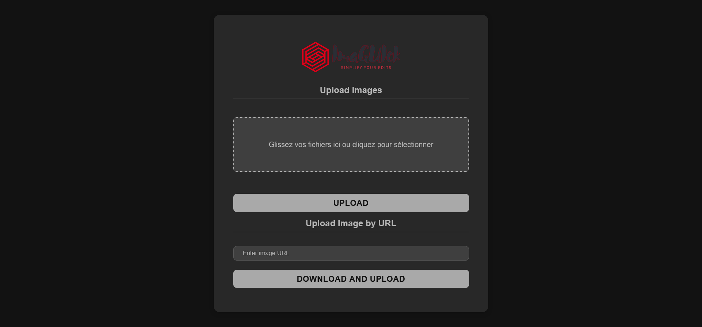
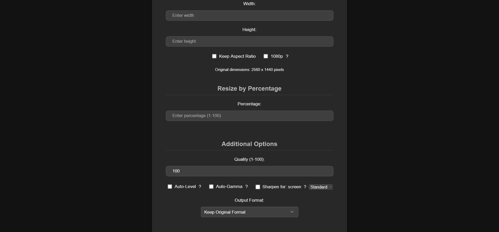

<p align="center">
  
</p>

<p align="center">
  
  <a href="https://github.com/tiritibambix/ImaGUIck/actions/workflows/github-code-scanning/codeql">
    
  </a>
</div>


ImaGUIck is a simple and intuitive web application for batch image processing, providing a user-friendly graphical interface to resize and convert your images.

## ⚠️ Security Notice

This application is designed for local usage only. While it can be exposed to the internet, doing so is at your own risk and not recommended without implementing additional security measures. The application does not include built-in authentication or advanced security features.

## ✨ Features

- 🖼️ **Single or Batch Image Processing**:
  - Process individual images
  - Batch process multiple images with ZIP export
  - Clear success/error feedback for each operation
- 📏 **Flexible Resizing Options**:
  - By specific dimensions (width x height)
  - By percentage
  - With or without aspect ratio preservation
  - One-click 1080p option for social media optimization (resizes longest edge to 1080px while preserving aspect ratio)
- 🔄 **Smart Format Support**:
  - Common formats (JPG, PNG, GIF, etc.)
  - RAW formats (ARW, CR2, CR3, NEF, RAF, RW2, DNG)
  - Modern formats (WEBP, AVIF, HEIC)
  - Animation formats (GIF, WEBP, APNG)
  - Vector formats (SVG, PDF, EPS)
- ✨ **Automatic Image Enhancement**:
  - Auto-level for dynamic range optimization
  - Auto-gamma for balanced exposure correction
  - Screen-optimized sharpening with three levels (low, standard, high)
- 🌐 **Image Import from URL**
- 📦 **Enhanced Batch Processing**:
  - ZIP export with organized structure
  - Detailed processing status for each image
  - Error handling with specific feedback
- 🎨 **Advanced Image Analysis**:
  - Automatic transparency detection
  - Photo vs. graphic type detection
  - Format-specific optimizations
- 💾 **Smart Format Recommendations**:
  - Context-aware format suggestions
  - Quality-preserving options (PNG, DNG)
  - Format-specific optimizations
  - Support for modern compression formats
- 🔍 **Automatic Image Type Analysis**
- 🔍 **Intelligent Format Recommendations**

### Screenshots





## 🚀 Installation

### Prerequisites

- Python 3.9+
- [`ImageMagick 7.1.1-41`](https://github.com/ImageMagick/ImageMagick/releases/tag/7.1.1-41) or newer
  - Windows users: Add ImageMagick to your system's PATH during installation
  - Linux users: Install development headers (e.g., `libmagickwand-dev`)
- ExifTool for metadata handling
- Docker (recommended for easier deployment)

### Local Installation

1. Clone the repository:
   ```bash
   git clone https://github.com/tiritibambix/ImaGUIck.git
   cd ImaGUIck
   ```

2. Create required directories:
   ```bash
   mkdir -p uploads output
   ```

3. Install Python dependencies:
   ```bash
   pip install -r requirements.txt
   ```

4. Verify installations:
   ```bash
   # Verify ImageMagick
   magick -version
   
   # Verify ExifTool
   exiftool -ver
   ```

5. Run the application:
   ```bash
   python app.py
   ```

   The application will be available at `http://localhost:5000`

> **Note**: The local installation includes automatic cleanup of files older than 48 hours. 
> To manually trigger cleanup, run:
> ```bash
> python cleanup.py --now
> ```

### Docker Installation (Recommended)

1. Clone the repository

   ```bash
   git clone https://github.com/tiritibambix/ImaGUIck.git
   cd ImaGUIck
   ```

2. Build the Docker image

   ```bash
   docker build -t imaguick .
   ```

3. Run the application

   ```bash
   docker run -it --rm \
       -v $(pwd)/uploads:/app/uploads \
       -v $(pwd)/output:/app/output \
       -p 5000:5000 \
       imaguick
   ```
 
#### Alternatively, you can use docker-compose to run the application:

```yaml
services:
  imaguick:
    stdin_open: true
    tty: true
    volumes:
      - ./uploads:/app/uploads
      - ./output:/app/output
    ports:
      - 5000:5000
    image: tiritibambix/imaguick:latest
networks: {}
```

## 🖥️ Usage

1. Access the application via your browser: `http://localhost:5000`

2. Choose your import method:
   - Upload file(s) from your computer
   - Import from a URL

3. Configure your processing options:
   - Output dimensions
   - Image quality
   - Output format

4. Start processing and download your images.

### Automatic Cleanup

- Uploaded and processed files are automatically cleaned up after 48 hours
- To manually trigger an immediate cleanup:
  ```bash
  docker exec <container_name> /app/cleanup.sh
  ```
  Replace `<container_name>` with your container name (e.g., `imaguick`)

## 🛠️ Technical Architecture

### Technologies Used

- **Backend**: Flask (Python)
- **Image Processing**: 
  - ImageMagick 7.1.1-41
  - ExifTool
  - Pillow
- **Frontend**: HTML/CSS/JavaScript
- **Containerization**: Docker

### Project Structure

```
imaguick/
├── Dockerfile                  # Container configuration and build instructions
├── LICENSE                     # Project and ImageMagick licenses
├── README.md                   # Project documentation
├── TODO.md                     # Development roadmap and planned features
├── app.py                      # Main application logic and routes
├── cleanup.py                  # Automatic file cleanup script
├── cleanup.sh                  # Shell script for manual cleanup
├── docker-compose.yml          # Docker Compose configuration
├── requirements.txt            # Python package dependencies
├── start.sh                    # Container startup script
├── templates                   # HTML templates for the web interface
|     ├── base.html             # Base template with common styling
|     ├── index.html            # Main upload and import page
|     ├── resize.html           # Single image processing options
|     ├── resize_batch.html     # Batch processing configuration
|     ├── result.html           # Success/Error feedback display
```

The application follows a clean and modular structure:
- Core application files at the root level for easy deployment
- Separate cleanup scripts for automated and manual file management
- Containerization support with Docker and Docker Compose
- Modular template system for the web interface

## 🤝 Contribution

Contributions are welcome! To contribute:

1. Fork the project
2. Create a branch for your feature (`git checkout -b feature/AmazingFeature`)
3. Commit your changes (`git commit -m 'Add some AmazingFeature'`)
4. Push to the branch (`git push origin feature/AmazingFeature`)
5. Open a Pull Request

## 📝 License

This project is licensed under the GNU General Public License v3.0 - see the [LICENSE](LICENSE) file for details. 
**ImageMagick's** license can be found [HERE](https://imagemagick.org/script/license.php).


### Customization

- Modify supported formats: See the `get_available_formats()` function in `app.py`
- Add new processing features: Extend the `build_imagemagick_command()` function in `app.py`

## 📫 Contact

For any questions or suggestions, feel free to:
- Open an issue on GitHub
- Submit a pull request
- Contact the project maintainer

---

Made with ❤️ in Python
